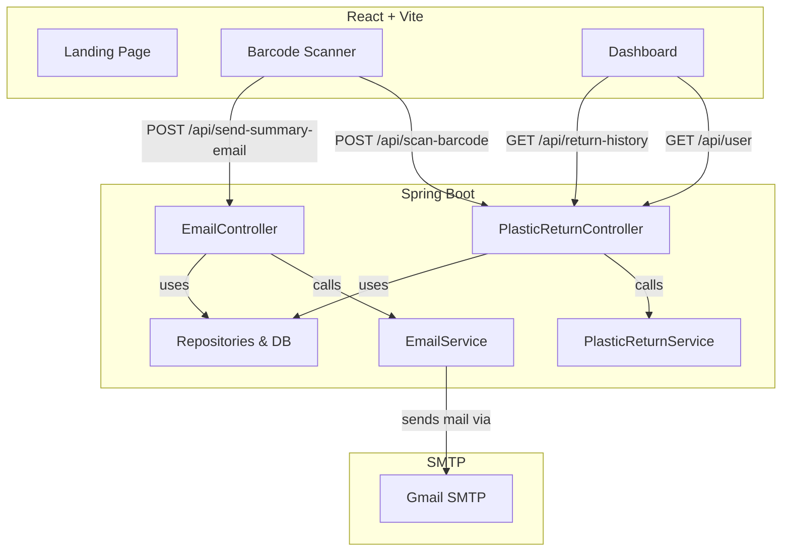
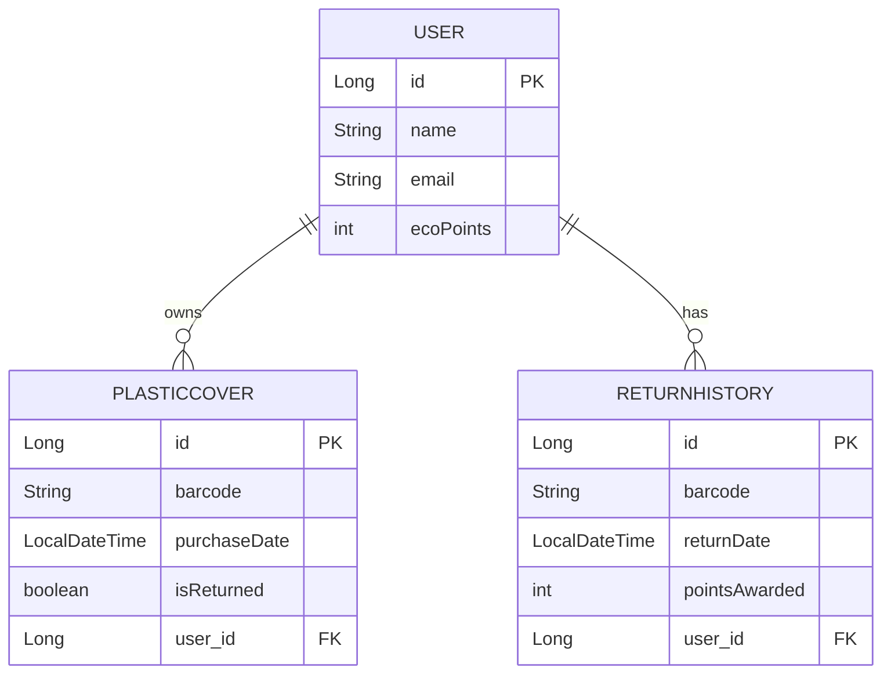

# ♻️ EcoRewards: Plastic Return System

EcoRewards is a full-stack application that encourages users to return plastic covers by scanning them, awarding EcoPoints, and providing dashboards and summary emails. Built with **Spring Boot** (backend) and **React + Vite** (frontend).

---

## 📚 Table of Contents

1. [Features](#features)
2. [Architecture Overview](#architecture-overview)
3. [Database Model](#database-model)
4. [Project Folder Structure](#project-folder-structure)
5. [Backend Setup](#backend-setup)
6. [Frontend Setup](#frontend-setup)
7. [Environment Variables](#environment-variables)
8. [Tech Stack](#tech-stack)
9. [License](#license)

---

## 🚀 Features

- **Scan** plastic cover barcodes using your camera or manual input
- **Award EcoPoints** for every valid return (+10 per cover)
- **Dashboard** to track user points and return history
- **Email summary** after each scan session
- **MySQL** persistence for users, covers, and history

---

## 🏗️ Architecture Overview



---

## 🗄️ Database Model



---

## 📂 Project Folder Structure

eco-rewards/
│
├── frontend/                  # React + Vite frontend
│   ├── public/                 # Static assets
│   ├── src/                    # App source code
│   │   ├── components/         # Reusable UI components
│   │   ├── pages/              # Page-level components
│   │   ├── services/           # API calls
│   │   ├── App.jsx              # Root component
│   │   └── main.jsx             # Entry point
│   ├── package.json
│   └── .env                    # API base URL (ignored in Git)
│
├── backend/                   # Spring Boot backend
│   ├── src/
│   │   ├── main/
│   │   │   ├── java/           # Java source code
│   │   │   │   └── com/example/ecorewards/
│   │   │   └── resources/      # Config files (application.properties)
│   │   └── test/               # Unit tests
│   ├── pom.xml
│   └── target/                 # Build output (ignored in Git)
│
├── .gitignore
├── README.md
└── LICENSE

## ⚙️ Backend Setup
Install Java 17+ and Maven.
Create a MySQL database:
``` bash
CREATE DATABASE ecorewards;
```
Configure backend/src/main/resources/application.properties:
``` bash
spring.datasource.url=jdbc:mysql://localhost:3306/ecorewards
spring.datasource.username=your_username
spring.datasource.password=your_password
spring.jpa.hibernate.ddl-auto=update
# Email configuration
spring.mail.host=smtp.gmail.com
spring.mail.port=587
spring.mail.username=your_email@gmail.com
spring.mail.password=your_app_password
spring.mail.properties.mail.smtp.auth=true
spring.mail.properties.mail.smtp.starttls.enable=true
```
Run the backend:
``` bash
cd backend
./mvnw spring-boot:run
```
API runs at: http://localhost:8080
## ⚛️ Frontend Setup
Install Node.js 18+ and npm.
Configure frontend/.env:
``` bash
REACT_APP_API_URL=http://localhost:8080/api
```
Start the frontend:
``` bash
cd frontend
npm install
npm run dev
```
Visit: http://localhost:5173
## 🔑 Environment Variables
Location	Variable Name	Description
Frontend	REACT_APP_API_URL	Backend API base URL
Backend	spring.datasource.*	MySQL connection settings
Backend	spring.mail.*	Email server configuration
## 🧰 Tech Stack
Frontend
React + Vite
Axios
CSS Modules
react-qr-barcode-scanner
Backend
Spring Boot
Spring Data JPA
MySQL
JavaMail
ZXing (barcode scanning)

---

## ⚛️ Frontend Overview

- **Landing Page**: Introduction and start scanning CTA
- **Scanner**: Scan barcodes via camera, send to backend, show messages & points, send summary email at session end
- **Dashboard**: View user EcoPoints, and return history in a table

---

## 🏁 Getting Started

### Backend

1. **Configure MySQL** and update `src/main/resources/application.properties` with your DB credentials.
2. **Run the backend**:
    ```sh
    ./mvnw spring-boot:run
    ```
3. Database is auto-seeded with demo users and covers.

### Frontend

1. `cd` into the frontend directory.
2. Install dependencies:
    ```sh
    npm install
    ```
3. Start the dev server:
    ```sh
    npm run dev
    ```
4. Visit [http://localhost:5173](http://localhost:5173) to use the app.

---

## 🧰 Tech Stack

- **Backend**: Spring Boot, Spring Data JPA, MySQL, JavaMail, ZXing (barcode)
- **Frontend**: React, Vite, Axios, react-qr-barcode-scanner
- **Styling**: CSS modules, responsive and accessible UI

---

## 📝 License

MIT License

---

**Let’s make the world greener, one plastic cover at a time! 🌱**
